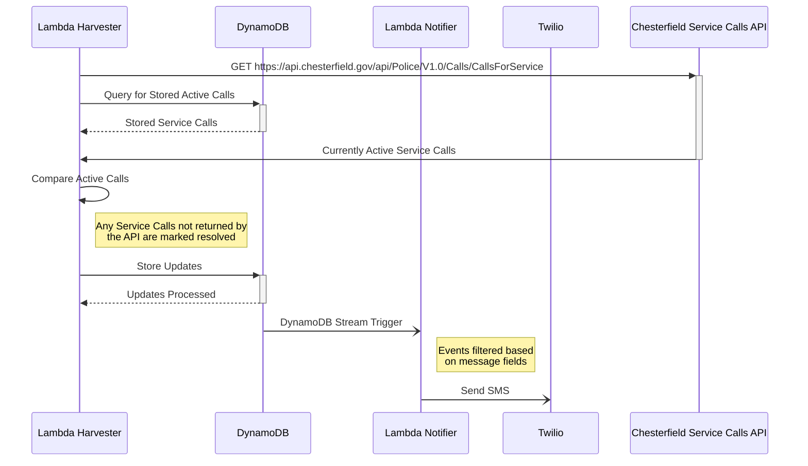

# Active Calls Application

## History

This project is a rewrite of an existing application I wrote in 2019. The existing application is an Azure Function which polls the API for [this site](https://www.chesterfield.gov/3999/Active-Police-Calls) for active police calls, i.e. events that police are dispatched to. When an event that matches some criteria is found, it will send me a text message with the details, e.g. an active call on my street. The application has been running solidly for 3 years and for the vast majority of that time only cost $0.01/mo. Within the last few months (in 2022) the activity on the storage account has increased and costs a few pennies more per month.

The purpose of this rewrite is to try out Go for the first time, move my infrastructure over to AWS, and create some example code that I can publicly share. While the function of the app is very simple, it has an enormous potential for new features and additions.

## Architecture

## To Do

* Monitoring
* GraphQL API and UI for visualizing service calls
* More flexible subscription model, via SNS
  * Multi-user support
  * Backend store for subscriptions and users
* End-user configurable subscriptions, with UI/API
* Additional unit test coverage for lambda notifier
  * This part was thrown together in a rush